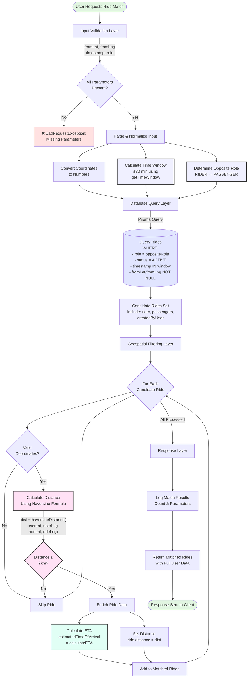
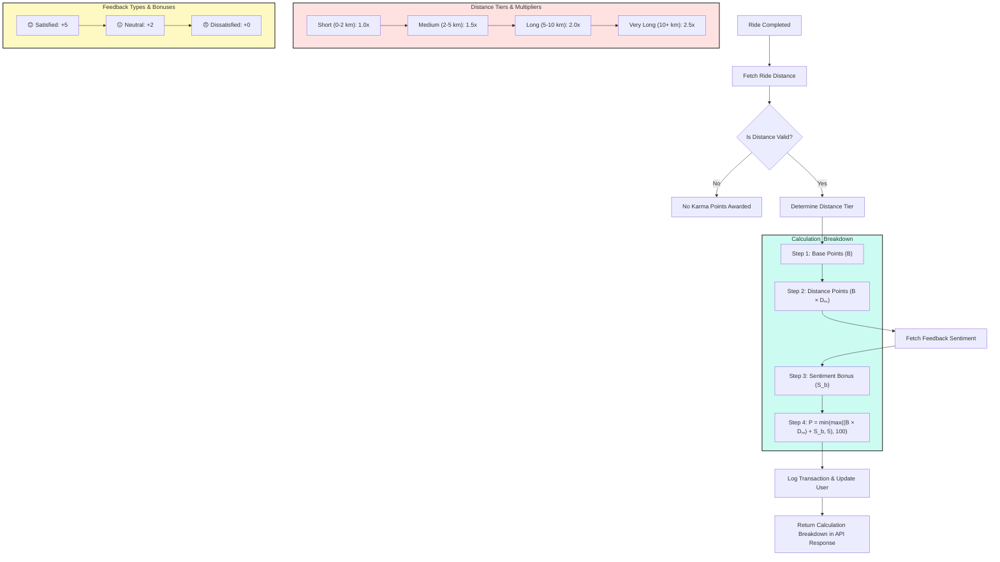
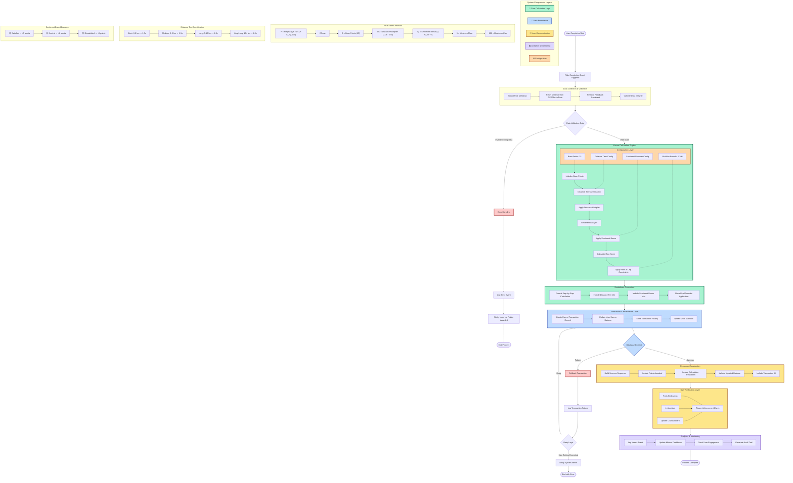
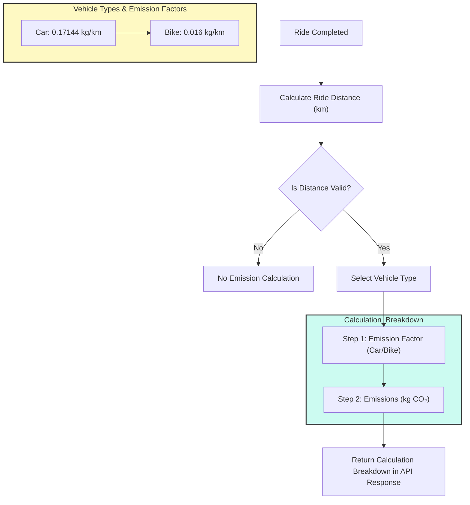
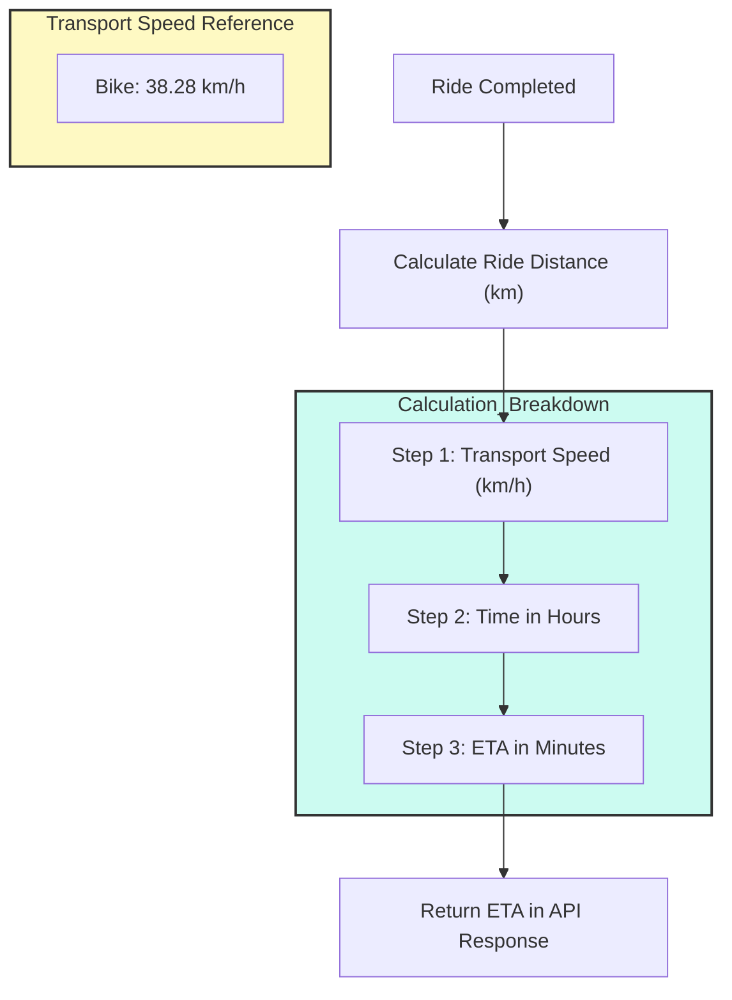

# Complete WorkRide Workflow (Login to Karma Redemption)

```mermaid
flowchart TD
    A["User Registration/Login"] --> B["Log: Login attempt for email"]:::log_info
    B --> C{"Role Selection"}
    C --> |"RIDER"| D1["Dashboard Access (Rider)"]
    C --> |"PASSENGER"| D2["Dashboard Access (Passenger)"]

    D1 --> E1["Create Ride as RIDER"]
    D2 --> E2["Create Ride as PASSENGER"]

    E1 --> F1["Log: Ride creation attempt by userId - RIDER role"]:::log_info
    E2 --> F2["Log: Ride creation attempt by userId - PASSENGER role"]:::log_info

    F1 --> G["Validate User Role & Active Rides"]
    F2 --> G

    G --> H{"Role matches user.role?"}
    H --> |"No"| H1["Log: Role mismatch - Reject"]:::log_warn
    H --> |"Yes"| I["Check Existing Active Rides"]

    I --> J{"Has active/confirmed ride?"}
    J --> |"Yes"| J1["Log: User already has active ride"]:::log_warn
    J --> |"No"| K["Create Ride in DB (Status: ACTIVE)"]

    K --> L["Match Rides (GET /rides/match)"]
    L --> M["Log: Matching rides for role & location"]:::log_info
    M --> N["Haversine Distance Check"]

    N --> O{"Distance ≤ 3km (MAX_RIDE_PROXIMITY_KM)?"}
    O --> |"No"| O1["No Match Found"]
    O --> |"Yes"| P["Calculate ETA & Display Matches"]

    P --> Q["Confirm Ride (POST /rides/:id/confirm)"]
    Q --> R["Generate UUID matchGroupId"]
    R --> S["Update Ride Status to CONFIRMED"]
    S --> T["Log: Confirmed matched rides with IDs"]:::log_info

    T --> U["Complete Ride (POST /rides/:id/complete)"]
    U --> V{"User part of this ride?"}
    V --> |"No"| V1["Throw: Not authorized"]
    V --> |"Yes"| W{"Ride status = CONFIRMED?"}

    W --> |"No"| W1["Log: Ride not confirmed - reject"]:::log_warn
    W --> |"Yes"| X["Calculate Distance & CO2 via Haversine"]

    X --> Y["Update All Rides in matchGroup to COMPLETED"]
    Y --> Z["Log: Ride completed by userId with metrics"]:::log_info
    Z --> AA["Notify Users via Socket (RideGateway)"]

    AA --> BB["Submit Feedback (POST /feedback)"]
    BB --> CC["Log: Feedback submission attempt"]:::log_info
    CC --> DD["Validate Feedback Rating (FEEDBACK_EMOJI: 0-2)"]

    DD --> EE{"Valid rating & no duplicate?"}
    EE --> |"No"| EE1["Log: Invalid feedback/duplicate"]:::log_warn
    EE --> |"Yes"| FF["Calculate Karma Points using TIERED_LINEAR_SCALING"]

    FF --> GG["Distance Tier Classification"]
    GG --> HH["Apply Base Points (15) × Distance Multiplier"]
    HH --> II["Add Sentiment Bonus (0/2/5 points)"]
    II --> JJ["Final: min(max((B × Dm) + Sb, 5), 100)"]

    JJ --> KK{"Feedback from RIDER or PASSENGER?"}
    KK --> |"RIDER"| LL["Update karmaPoints += totalPoints"]
    KK --> |"PASSENGER"| MM["Update creditScore += totalPoints"]

    LL --> NN["Create karmaTransaction (type: 'earned')"]
    MM --> NN
    NN --> OO["Log: Points awarded with algorithm breakdown"]:::log_info

    OO --> PP["View Karma Points (GET /rides/user/:id/karma-points)"]
    PP --> QQ["Access Redemption Page"]
    QQ --> RR["Display Available Rewards"]

    RR --> SS["Select Reward for Redemption"]
    SS --> TT{"karmaPoints ≥ rewardCost?"}
    TT --> |"No"| UU["Show Insufficient Points Error"]
    TT --> |"Yes"| VV["Confirm Redemption Dialog"]

    VV --> WW["Submit Redemption (POST /karma/redeem)"]
    WW --> XX["Log: Karma redemption attempt"]:::log_info
    XX --> YY["Validate User & Sufficient Points"]
    YY --> ZZ["Generate Voucher Code"]
    ZZ --> AAA["Create karmaTransaction (type: 'redeemed')"]
    AAA --> BBB["Deduct karmaPoints"]
    BBB --> CCC["Set Status to ACTIVE & expiresAt"]
    CCC --> DDD["Display Voucher/Gift Card"]
    DDD --> EEE["Log: Successful redemption with details"]:::log_info

    %% Ride Status Reference
    subgraph Ride_Status_Reference["Ride Status Types"]
        RS1["IDLE: Initial state"]:::status
        RS2["ACTIVE: Available for matching"]:::status
        RS3["CONFIRMED: Matched & confirmed"]:::status
        RS4["COMPLETED: Ride finished"]:::status
        RS5["REJECTED: Manually rejected"]:::status
        RS6["EXPIRED: Auto-expired after grace period"]:::status
        RS7["CANCELLED: User cancelled"]:::status
    end

    %% Feedback Emoji Reference
    subgraph Feedback_Emoji_Reference["Feedback Types & Sentiment Bonuses"]
        FE1["😊 SATISFIED (0): +5 points"]:::feedback
        FE2["😐 NEUTRAL (1): +2 points"]:::feedback
        FE3["😠 DISSATISFIED (2): +0 points"]:::feedback
    end

    %% Distance Tiers Reference
    subgraph Distance_Tiers_Reference["Distance Tiers & Multipliers"]
        DT1["SHORT (0-2km): 1.0x"]:::distance
        DT2["MEDIUM (2-5km): 1.5x"]:::distance
        DT3["LONG (5-10km): 2.0x"]:::distance
        DT4["VERY_LONG (10+km): 2.5x"]:::distance
    end

    %% Redemption Status Reference
    subgraph Redemption_Status_Reference["Redemption Status Types"]
        RED1["ACTIVE: Can be used"]:::redemption
        RED2["USED: Already redeemed"]:::redemption
        RED3["EXPIRED: Past expiry date"]:::redemption
        RED4["LOCKED: Temporarily locked"]:::redemption
    end

    %% Log styling
    classDef log_info fill:#e3f2fd,stroke:#1976d2,stroke-width:2px,color:#1976d2
    classDef log_warn fill:#fff3e0,stroke:#f57c00,stroke-width:2px,color:#f57c00
    classDef log_error fill:#ffebee,stroke:#d32f2f,stroke-width:2px,color:#d32f2f

    %% Reference styling
    classDef status fill:#f3e5f5,stroke:#7b1fa2,stroke-width:1px
    classDef feedback fill:#e8f5e8,stroke:#2e7d32,stroke-width:1px
    classDef distance fill:#fff3e0,stroke:#f57c00,stroke-width:1px
    classDef redemption fill:#fce4ec,stroke:#c2185b,stroke-width:1px

    %% Subgraph styling
    style Ride_Status_Reference fill:#f8f9fa,stroke:#6c757d,stroke-width:2px
    style Feedback_Emoji_Reference fill:#f8f9fa,stroke:#6c757d,stroke-width:2px
    style Distance_Tiers_Reference fill:#f8f9fa,stroke:#6c757d,stroke-width:2px
    style Redemption_Status_Reference fill:#f8f9fa,stroke:#6c757d,stroke-width:2px
```

<!-- high level diagram -->

  
High Level Diagram

```mermaid
graph TB
    Start([User Visits Application]) --> AuthChoice{User Status?}

    AuthChoice -->|New User| Signup[POST /auth/signup]
    AuthChoice -->|Existing User| Login[POST /auth/login]

    Signup --> SignupValidate{Validate Input}
    SignupValidate -->|Invalid| SignupError[❌ BadRequestException:<br/>Missing/Invalid Fields]
    SignupValidate -->|Valid| CheckEmail{Email<br/>Exists?}

    CheckEmail -->|Yes| EmailError[❌ BadRequestException:<br/>Email Already Registered]
    CheckEmail -->|No| HashPassword[Hash Password<br/>bcrypt.hash]

    HashPassword --> CreateUser[Create User in DB<br/>role: RIDER/PASSENGER<br/>karmaPoints: 0<br/>creditScore: 0]
    CreateUser --> LogSignup[📝 Log: Signup Successful<br/>tag: auth]
    LogSignup --> ReturnUser1[Return User Object<br/>without password]

    Login --> LoginValidate{Validate Input}
    LoginValidate -->|Invalid| LoginError1[❌ BadRequestException:<br/>Missing reCAPTCHA]
    LoginValidate -->|Valid - Prod| VerifyRecaptcha[Verify reCAPTCHA<br/>Google API]
    LoginValidate -->|Valid - Dev| SkipRecaptcha[Skip reCAPTCHA<br/>Development Mode]

    VerifyRecaptcha -->|Failed| LoginError2[❌ UnauthorizedException:<br/>reCAPTCHA Failed]
    VerifyRecaptcha -->|Success| FindUser[Find User by Email]
    SkipRecaptcha --> FindUser

    FindUser -->|Not Found| LoginError3[❌ UnauthorizedException:<br/>User Not Found]
    FindUser -->|Found| CheckPassword{bcrypt.compare<br/>Password Valid?}

    CheckPassword -->|No| LoginError4[❌ UnauthorizedException:<br/>Invalid Password]
    CheckPassword -->|Yes| LogLogin[📝 Log: Login Successful<br/>tag: auth]
    LogLogin --> ReturnUser2[Return User Object<br/>without password]

    ReturnUser1 --> Dashboard
    ReturnUser2 --> Dashboard

    Dashboard[User Dashboard] --> CheckActiveRide{Check Active<br/>Ride Status}

    CheckActiveRide --> GetCurrent[GET /rides/user/:userId/current]
    GetCurrent --> ExpireOld1[Expire Old Rides<br/>status: ACTIVE/CONFIRMED<br/>→ EXPIRED if past grace period]
    ExpireOld1 --> HasActive{Has Active<br/>or Confirmed<br/>Ride?}

    HasActive -->|Yes| DisplayActive[Display Active Ride<br/>with Expiry Timer<br/>remainingTimeSeconds]
    HasActive -->|No| CreateRideOption[Option: Create New Ride]

    CreateRideOption --> CreateRide[POST /rides]
    CreateRide --> ValidateCreate{Validate<br/>Required Fields}

    ValidateCreate -->|Invalid| CreateError1[❌ BadRequestException:<br/>Missing Fields]
    ValidateCreate -->|Valid| CheckUser{User<br/>Exists?}

    CheckUser -->|No| CreateError2[❌ NotFoundException:<br/>User Not Found]
    CheckUser -->|Yes| VerifyRole{Role<br/>Matches?}

    VerifyRole -->|No| CreateError3[❌ BadRequestException:<br/>Role Mismatch]
    VerifyRole -->|Yes| CheckExisting{Existing Active/<br/>Confirmed Ride?}

    CheckExisting -->|Yes| CreateError4[❌ BadRequestException:<br/>Already Have Active Ride]
    CheckExisting -->|No| DetermineRoleIds{Determine<br/>Role Assignment}

    DetermineRoleIds -->|RIDER| SetRider[riderId = userId<br/>passengerId = null]
    DetermineRoleIds -->|PASSENGER| SetPassenger[riderId = null<br/>passengerId = userId]

    SetRider --> CreateInDB[Create Ride in DB<br/>status: ACTIVE<br/>timestamp: now/scheduled]
    SetPassenger --> CreateInDB

    CreateInDB --> LogCreate[📝 Log: Ride Created<br/>tag: ride]
    LogCreate --> BroadcastNew[🔔 WebSocket Broadcast:<br/>New Ride Available]
    BroadcastNew --> RideActive[Ride Status: ACTIVE]

    RideActive --> MatchingPhase[Matching Phase]

    MatchingPhase --> OtherUsers[Other Users Browse Rides]
    OtherUsers --> GetRides[GET /rides?role=RIDER/PASSENGER]
    GetRides --> ExpireOld2[Expire Old Rides<br/>timestamp < cutoff]
    ExpireOld2 --> FilterRides[Filter: status IN<br/>ACTIVE, CONFIRMED<br/>timestamp >= now]
    FilterRides --> DisplayRides[Display Available Rides<br/>with expiryTimeSeconds]

    DisplayRides --> UserSearches{User Initiates<br/>Search?}

    UserSearches -->|Yes| MatchRides[GET /rides/match]
    UserSearches -->|No| ManualBrowse[Manual Browse & Selection]

    MatchRides --> ValidateMatch{Validate<br/>Query Params}
    ValidateMatch -->|Invalid| MatchError[❌ BadRequestException:<br/>Missing Params]
    ValidateMatch -->|Valid| CalcTimeWindow[Calculate Time Window<br/>±30 min using<br/>RIDE_MATCH_WINDOW_MINUTES]

    CalcTimeWindow --> DetermineOpposite{Determine<br/>Opposite Role}
    DetermineOpposite -->|User=RIDER| QueryPassengers[Query: role=PASSENGER<br/>status=ACTIVE<br/>time IN window]
    DetermineOpposite -->|User=PASSENGER| QueryRiders[Query: role=RIDER<br/>status=ACTIVE<br/>time IN window]

    QueryPassengers --> FilterDistance[Filter by Distance]
    QueryRiders --> FilterDistance

    FilterDistance --> IterateMatches{For Each<br/>Candidate}
    IterateMatches --> ValidateCoords{Valid<br/>Coordinates?}
    ValidateCoords -->|No| SkipMatch[Skip Candidate]
    ValidateCoords -->|Yes| CalcHaversine[Calculate Distance<br/>haversineDistance]

    CalcHaversine --> CheckProximity{Distance ≤<br/>2km MAX_RIDE_<br/>PROXIMITY_KM?}
    CheckProximity -->|No| SkipMatch
    CheckProximity -->|Yes| EnrichMatch[Enrich Ride:<br/>- estimatedTimeOfArrival<br/>- distance]

    EnrichMatch --> AddMatch[Add to Matched Rides]
    SkipMatch --> IterateMatches
    AddMatch --> IterateMatches

    IterateMatches -->|All Done| LogMatches[📝 Log: Match Results<br/>tag: ride, matchedCount]
    LogMatches --> DisplayMatches[Display Matched Rides<br/>⚠️ Exposes Full User Data]

    ManualBrowse --> SelectRide[User Selects Ride]
    DisplayMatches --> SelectRide

    SelectRide --> ConfirmRide[POST /rides/:id/confirm]
    ConfirmRide --> FetchRides{Fetch Current<br/>& Target Ride}

    FetchRides -->|Not Found| ConfirmError[❌ NotFoundException:<br/>Ride Not Found]
    FetchRides -->|Found| DetermineMatch{Current Ride<br/>Role?}

    DetermineMatch -->|RIDER| SetPassengerMatch[Validate passengerId<br/>& passengerRideId<br/>Set: riderId, passengerId]
    DetermineMatch -->|PASSENGER| SetRiderMatch[Validate riderId<br/>& riderRideId<br/>Set: riderId, passengerId]

    SetPassengerMatch --> GenerateMatchGroup[Generate UUID<br/>matchGroupId]
    SetRiderMatch --> GenerateMatchGroup

    GenerateMatchGroup --> UpdateBoth[Update Both Rides:<br/>status: CONFIRMED<br/>riderId, passengerId<br/>matchGroupId]

    UpdateBoth --> ConnectPassenger[Connect Passenger<br/>to Both Rides<br/>Many-to-Many Relation]
    ConnectPassenger --> LogConfirm[📝 Log: Rides Confirmed<br/>tag: ride<br/>rideIds, riderId, passengerId]
    LogConfirm --> NotifyConfirm[🔔 WebSocket:<br/>notifyRideConfirmation<br/>to Both Users]

    NotifyConfirm --> RideConfirmed[Ride Status: CONFIRMED]

    RideConfirmed --> RideInProgress[Ride In Progress]
    RideInProgress --> CompleteAction{Either User<br/>Completes Ride}

    CompleteAction --> CompleteRide[POST /rides/:id/complete<br/>⚠️ SECURITY: userId in body]
    CompleteRide --> FetchComplete{Fetch Ride<br/>with Relations}

    FetchComplete -->|Not Found| CompleteError1[❌ NotFoundException:<br/>Ride Not Found]
    FetchComplete -->|Found| VerifyUser{User Part<br/>of Ride?}

    VerifyUser -->|No| CompleteError2[❌ BadRequestException:<br/>Not Authorized]
    VerifyUser -->|Yes| CheckConfirmed{Status =<br/>CONFIRMED?}

    CheckConfirmed -->|No| CompleteError3[❌ BadRequestException:<br/>Only Confirmed Rides]
    CheckConfirmed -->|Yes| CalcStats[Calculate Statistics]

    CalcStats --> CalcDistance[Distance:<br/>haversineDistance<br/>from → to]
    CalcStats --> CalcCO2[CO2 Saved:<br/>estimateCO2FromDistance]
    CalcStats --> CountPeople[People Impacted:<br/>passengers.length]

    CalcDistance --> UpdateGroup{matchGroupId<br/>Exists?}
    CalcCO2 --> UpdateGroup
    CountPeople --> UpdateGroup

    UpdateGroup -->|Yes| UpdateAll[Update ALL Rides<br/>with matchGroupId:<br/>status: COMPLETED<br/>distance, co2Saved,<br/>peopleImpacted]
    UpdateGroup -->|No| UpdateSingle[Update Single Ride:<br/>status: COMPLETED<br/>distance, co2Saved,<br/>peopleImpacted]

    UpdateAll --> LogComplete[📝 Log: Ride Completed<br/>tag: ride<br/>completedByUserId, distance,<br/>co2Saved, peopleImpacted,<br/>updatedRideCount]
    UpdateSingle --> LogComplete

    LogComplete --> NotifyComplete[🔔 WebSocket:<br/>notifyRideCompletion<br/>Show Feedback Modal]

    NotifyComplete --> FeedbackPhase[Feedback Phase]

    FeedbackPhase --> BothSubmit{Both Users<br/>Submit Feedback}

    BothSubmit --> SubmitFeedback[POST /rides/feedback<br/>⚠️ SECURITY: fromUserId in body]
    SubmitFeedback --> ValidateFeedback{Validate<br/>Required Fields}

    ValidateFeedback -->|Invalid| FeedbackError1[❌ BadRequestException:<br/>Missing Fields]
    ValidateFeedback -->|Valid| ValidateEmoji{Valid<br/>FEEDBACK_EMOJI?}

    ValidateEmoji -->|Invalid| FeedbackError2[❌ BadRequestException:<br/>Invalid Rating 0/1/2]
    ValidateEmoji -->|Valid| CheckRideStatus{Ride Status<br/>= COMPLETED?}

    CheckRideStatus -->|No| FeedbackError3[❌ BadRequestException:<br/>Only Completed Rides]
    CheckRideStatus -->|Yes| VerifyParticipant{User Part<br/>of Ride?}

    VerifyParticipant -->|No| FeedbackError4[❌ BadRequestException:<br/>Not Part of Ride]
    VerifyParticipant -->|Yes| CheckDuplicate{Feedback<br/>Already Exists?}

    CheckDuplicate -->|Yes| FeedbackError5[❌ BadRequestException:<br/>Already Submitted]
    CheckDuplicate -->|No| CreateFeedback[Create Feedback Record:<br/>rideId, fromUserId, toUserId<br/>role, emoji, comment]

    CreateFeedback --> CalcKarma[Calculate Karma Points<br/>Algorithm: TIERED_LINEAR_<br/>SCALING_WITH_SENTIMENT_<br/>WEIGHTING]

    CalcKarma --> KarmaAlgo[KarmaCalculationService:<br/>- Distance Tier<br/>- Base Points<br/>- Distance Multiplier<br/>- Sentiment Bonus<br/>= Total Points]

    KarmaAlgo --> LogKarma[📝 Log: Karma Calculation<br/>tag: feedback<br/>algorithm, distance, tier,<br/>multiplier, bonus, total]

    LogKarma --> UpdateRole{Feedback<br/>Role?}

    UpdateRole -->|RIDER| UpdateKarma[Update Rider:<br/>karmaPoints += totalPoints<br/>Create KarmaTransaction:<br/>type: earned]
    UpdateRole -->|PASSENGER| UpdateCredit[Update Passenger:<br/>creditScore += totalPoints]

    UpdateKarma --> LogReward[📝 Log: Points Awarded<br/>tag: feedback<br/>userId, role, points,<br/>calculation breakdown]
    UpdateCredit --> LogReward

    LogReward --> CheckBoth{Both Users<br/>Submitted?}

    CheckBoth -->|No| WaitingFeedback[Return: waitingForOtherUser<br/>feedbackComplete: false]
    CheckBoth -->|Yes| CompleteFeedback[Return: feedbackComplete<br/>Both Submitted]

    WaitingFeedback --> Dashboard
    CompleteFeedback --> Dashboard

    Dashboard --> ViewStats[View User Statistics]
    ViewStats --> GetKarma[GET /rides/user/:id/karma-points]
    ViewStats --> GetCredit[GET /rides/user/:id/credit-score]
    ViewStats --> GetAvgScore[GET /rides/user/:id/average-score]
    ViewStats --> GetPeopleImpacted[GET /rides/user/:id/people-impacted]

    GetKarma --> ReturnKarma[Return: karmaPoints]
    GetCredit --> ReturnCredit[Return: creditScore]
    GetAvgScore --> CalcAvg[Process Feedback:<br/>Calculate Average Emoji<br/>Count 😊/😐/😠]
    GetPeopleImpacted --> DedupeRides[Deduplicate by matchGroupId<br/>Count Unique Partners<br/>Sort by Ride Count]

    CalcAvg --> ReturnAvg[Return: averageScore<br/>totalFeedback, breakdown]
    DedupeRides --> ReturnPeople[Return: people array<br/>totalImpacted]

    ReturnKarma --> RedemptionPhase
    ReturnCredit --> RedemptionPhase
    ReturnAvg --> ViewHistory
    ReturnPeople --> ViewHistory

    ViewHistory --> GetHistory[GET /rides/history?userId]
    GetHistory --> ExpireOld3[Expire Old Rides]
    ExpireOld3 --> QueryHistory[Query Rides:<br/>riderId OR passengerId<br/>OR createdBy = userId]
    QueryHistory --> DedupeHistory[Deduplicate by matchGroupId<br/>Include: rider, passengers,<br/>createdByUser, requests,<br/>ratings, messages]
    DedupeHistory --> LogHistory[📝 Log: History Fetched<br/>tag: ride<br/>uniqueCount, originalCount]
    LogHistory --> DisplayHistory[Display Ride History<br/>⚠️ Exposes Full User Data]

    DisplayHistory --> Dashboard

    RedemptionPhase{User Wants<br/>to Redeem?}

    RedemptionPhase -->|Yes| RedeemKarma[POST /karma/redeem]
    RedemptionPhase -->|No| Dashboard

    RedeemKarma --> LogRedeem[📝 Log: Redemption Attempt<br/>tag: karma<br/>userId, rewardId]
    LogRedeem --> ProcessRedeem[KarmaRedemptionService:<br/>- Validate Points<br/>- Deduct Karma<br/>- Generate Code<br/>- Create Transaction]

    ProcessRedeem --> CreateTransaction[KarmaTransaction:<br/>type: redeemed<br/>status: ACTIVE<br/>redemptionCode<br/>expiresAt]

    CreateTransaction --> ReturnCode[Return: Redemption Code<br/>& Reward Details]
    ReturnCode --> ViewRedemptions[GET /karma/user/:userId]
    ViewRedemptions --> DisplayRedemptions[Display:<br/>- Active Redemptions<br/>- Expiry Times<br/>- Status]

    DisplayRedemptions --> UpdateStatus{Merchant<br/>Updates Status?}
    UpdateStatus -->|Yes| UpdateRedeem[PUT /karma/:code/status<br/>status: USED/EXPIRED/LOCKED]
    UpdateStatus -->|No| Dashboard

    UpdateRedeem --> LogUpdate[📝 Log: Status Updated<br/>tag: karma]
    LogUpdate --> Dashboard

    Dashboard --> LogAccess{Admin Access<br/>Logs?}
    LogAccess -->|Yes| GetLogs[GET /logs/today or<br/>GET /logs/all]
    LogAccess -->|No| Logout

    GetLogs --> ReadLogFiles[Read Log Files:<br/>application-YYYY-MM-DD.log<br/>Parse JSON Entries]
    ReadLogFiles --> DisplayLogs[Display Log Entries:<br/>level, message, tag,<br/>timestamp, userId, etc.]

    DisplayLogs --> Dashboard

    Logout --> LogoutEndpoint[POST /auth/logout]
    LogoutEndpoint --> LogLogout[📝 Log: Logout<br/>tag: auth]
    LogLogout --> End([Session Ended])

    style Start fill:#e1f5e1
    style End fill:#e1f5e1
    style SignupError fill:#ffe1e1
    style EmailError fill:#ffe1e1
    style LoginError1 fill:#ffe1e1
    style LoginError2 fill:#ffe1e1
    style LoginError3 fill:#ffe1e1
    style LoginError4 fill:#ffe1e1
    style CreateError1 fill:#ffe1e1
    style CreateError2 fill:#ffe1e1
    style CreateError3 fill:#ffe1e1
    style CreateError4 fill:#ffe1e1
    style MatchError fill:#ffe1e1
    style ConfirmError fill:#ffe1e1
    style CompleteError1 fill:#ffe1e1
    style CompleteError2 fill:#ffe1e1
    style CompleteError3 fill:#ffe1e1
    style FeedbackError1 fill:#ffe1e1
    style FeedbackError2 fill:#ffe1e1
    style FeedbackError3 fill:#ffe1e1
    style FeedbackError4 fill:#ffe1e1
    style FeedbackError5 fill:#ffe1e1

    style LogSignup fill:#fff3cd
    style LogLogin fill:#fff3cd
    style LogCreate fill:#fff3cd
    style LogConfirm fill:#fff3cd
    style LogComplete fill:#fff3cd
    style LogKarma fill:#fff3cd
    style LogReward fill:#fff3cd
    style LogRedeem fill:#fff3cd
    style LogUpdate fill:#fff3cd
    style LogLogout fill:#fff3cd
    style LogHistory fill:#fff3cd
    style LogMatches fill:#fff3cd

    style BroadcastNew fill:#e1f0ff
    style NotifyConfirm fill:#e1f0ff
    style NotifyComplete fill:#e1f0ff

    style RideActive fill:#d4edda
    style RideConfirmed fill:#d4edda

    style CalcHaversine fill:#ffe1f5
    style CheckProximity fill:#ffe1f5

    style DisplayMatches fill:#ffcccc
    style DisplayHistory fill:#ffcccc

    classDef securityIssue fill:#ffcccc,stroke:#cc0000,stroke-width:3px
    class CompleteRide,SubmitFeedback securityIssue
```

# Ride Matching Flowchart (Haversine Distance)

# Karma Points Calculation Flowchart

`Note`: High level diagram illustrating the karma points calculation process based on ride distance and user feedback sentiment.

High Level Overview

# Carbon Emissions Reduction Points Calculation Flowchart

# ETA Calculation Flowchart

